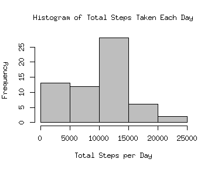
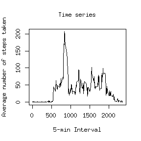
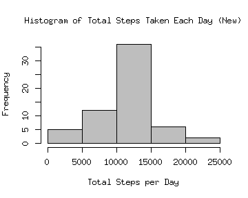
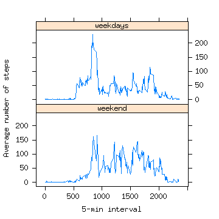

## Loading and preprocessing the data


```r
	activity <- read.csv("activity.csv", header=TRUE)
```

## What is mean total number of steps taken per day?

### Calculate the total number of steps taken per day


```r
	TotalStepsEachDay <- sapply(split(activity$steps,activity$date),sum, na.rm=TRUE)
```

### Make a histogram of the total number of steps taken each day


```r
	hist(TotalStepsEachDay, col = "grey", main = "Histogram of Total Steps Taken Each Day", xlab = "Total Steps per Day", ylab = "Frequency")
```

 

### Calculate and report the mean and median of the total number of steps taken per day


```r
	meanTotalStepsEachDay <- mean(TotalStepsEachDay, na.rm=TRUE)
	medianTotalStepsEachDay <- median(TotalStepsEachDay, na.rm=TRUE)
	print(paste("Mean of the total number of steps taken per day is: ", meanTotalStepsEachDay))
```

```
## [1] "Mean of the total number of steps taken per day is:  9354.22950819672"
```

```r
	print(paste("Median of the total number of steps taken per day is: ", medianTotalStepsEachDay))
```

```
## [1] "Median of the total number of steps taken per day is:  10395"
```

## What is the average daily activity pattern?
    
### Make a time series plot (i.e. type = "l") of the 5-minute interval (x-axis) and the average number of steps taken, averaged across all days (y-axis)


```r
	meanStepsPerInterval <- sapply(split(activity$steps,activity$interval), mean, na.rm=TRUE)

	StepsPerInterval <- data.frame(meanStepsPerInterval)
	StepsPerInterval[,2]<-as.integer(rownames(StepsPerInterval))

	plot(x=StepsPerInterval[,2], y=StepsPerInterval[,1], type="l", main = "Time series", xlab = "5-min Interval", ylab = "Average number of steps taken")
```

 


### Which 5-minute interval, on average across all the days in the dataset, contains the maximum number of steps?


```r
	maxSteps <- max(meanStepsPerInterval)
	IntervalMaxSteps <- which(meanStepsPerInterval == maxSteps)
	IntervalMaxSteps
```

```
## 835 
## 104
```

```r
	maxSteps
```

```
## [1] 206.1698
```
835 interval, which is in the 104th place, contains the maximum number of steps (in average) which is 206.1698.

## Imputing missing values

### Calculate and report the total number of missing values in the dataset (i.e. the total number of rows with NAs)


```r
	missingV <- sum(is.na(activity))
	print(paste("The total number of missing values in the dataset is: ", missingV))
```

```
## [1] "The total number of missing values in the dataset is:  2304"
```

### Devise a strategy for filling in all of the missing values in the dataset (the mean/median for that day, or the mean for that 5-minute interval, etc).
### Create a new dataset that is equal to the original dataset but with the missing data filled in.

Missing data is filled with the rounded mean for that 5-minute interval and the data is stored in "activityFill" variable.	


```r
	activityFill <- activity
	for (i in 1:nrow(activity)) {
		if (is.na(activity[i,1])) {
			indexToFill <- which(StepsPerInterval[,2] == activity[i,3])
    			activityFill[i,1] <- as.integer(StepsPerInterval[indexToFill,1])
  		}
	}	
```

### Make a histogram of the total number of steps taken each day and Calculate and report the mean and median total number of steps taken per day. Do these values differ from the estimates from the first part of the assignment? What is the impact of imputing missing data on the estimates of the total daily number of steps?


```r
	NewTotalStepsEachDay <- sapply(split(activityFill$steps,activity$date),sum)
	hist(NewTotalStepsEachDay, col= "grey", main = "Histogram of Total Steps Taken Each Day (New)", xlab = "Total Steps per Day", ylab = "Frequency")
```

 

```r
	NewMeanTotalStepsEachDay <- mean(NewTotalStepsEachDay)
	NewMedianTotalStepsEachDay <- median(NewTotalStepsEachDay)
	print(paste("New mean of the total number of steps taken per day is: ", NewMeanTotalStepsEachDay))
```

```
## [1] "New mean of the total number of steps taken per day is:  10749.7704918033"
```

```r
	print(paste("New median of the total number of steps taken per day is: ", NewMedianTotalStepsEachDay))
```

```
## [1] "New median of the total number of steps taken per day is:  10641"
```
Since the NA's are replaced with the rounded mean for that 5-minute interval rather than mean/median for that day, mean and median total number of steps taken per day differ from the estimates from the first part of the assignment. Imputing missing data increased the total daily number of steps, as well as the overall total number of steps.


## Are there differences in activity patterns between weekdays and weekends?

For this part the weekdays() function may be of some help here. Use the dataset with the filled-in missing values for this part.

### Create a new factor variable in the dataset with two levels – “weekday” and “weekend” indicating whether a given date is a weekday or weekend day.


```r
	library(timeDate)
	IntWeekDays <- as.integer(sapply(activityFill$date, isWeekday))
	# IntWeekendDays <- as.integer(sapply(activityFill$date, isWeekend))
```

### Make a panel plot containing a time series plot (i.e. type = "l") of the 5-minute interval (x-axis) and the average number of steps taken, averaged across all weekday days or weekend days (y-axis).


```r
	library(lattice)
	activityFinal <- cbind(activityFill, IntWeekDays)
	activityWeekDays <- activityFinal[activityFinal[,4]==1,] 	
	activityWeekendDays <- activityFinal[activityFinal[,4]==0,]

	NmSPI_weekdays <- sapply(split(activityWeekDays$steps,activityWeekDays$interval), mean)
	NmSPI_weekenddays <- sapply(split(activityWeekendDays$steps,activityWeekendDays$interval), mean)

	NmSPI_weekdays1 <- data.frame(NmSPI_weekdays)
	NmSPI_weekenddays1 <- data.frame(NmSPI_weekenddays)

	NmSPI_weekdays2 <- cbind(NmSPI_weekdays1,1, as.integer(rownames(NmSPI_weekdays1)))
	NmSPI_weekenddays2 <- cbind(NmSPI_weekenddays1,0, as.integer(rownames(NmSPI_weekenddays1)))

	rownames(NmSPI_weekenddays2) <- 1:288
	rownames(NmSPI_weekdays2) <- 289:576
	colnames(NmSPI_weekdays2) <- c("Average","WD","Interval")
	colnames(NmSPI_weekenddays2) <- c("Average","WD","Interval")
	
	NmSPI_all <- rbind(NmSPI_weekenddays2, NmSPI_weekdays2)
	
	WD.f<-factor(NmSPI_all$WD, levels=c(0, 1), labels=c("weekend", "weekdays")) 
	xyplot(Average ~ Interval| WD.f, data = NmSPI_all, type = "l", xlab = "5-min interval", ylab = "Average number of steps", layout=c(1,2))
```

 
